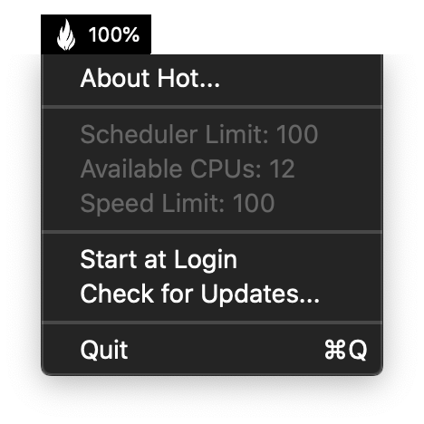
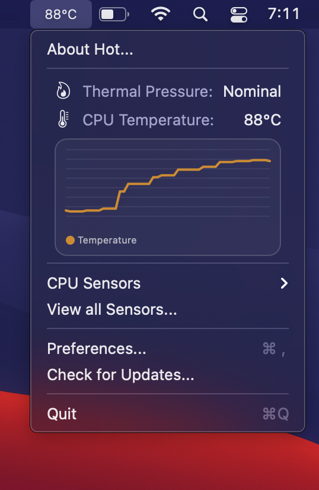
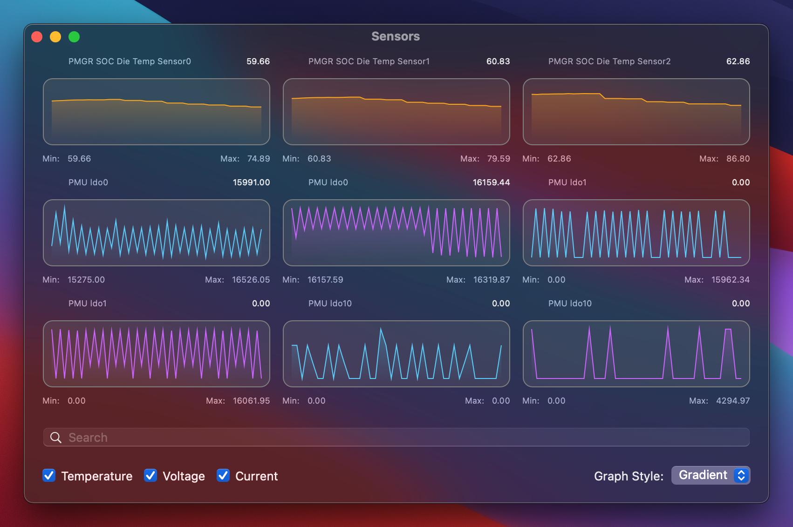

Hot
===

  

### About

Hot is macOS menu bar application that displays the CPU speed limit due to thermal issues.

#### Differences between the Intel and Apple Silicon versions

On an Intel machine, Hot will display the CPU temperature, CPU speed limit (throttling), scheduler limit and number of available CPUs.  
By default, the menu bar text will be colorized in orange if the CPU speed limit falls below 60%.

On Apple Silicon, these informations are not available.  
Along with the CPU temperature, Hot will display the system's thermal pressure.  
The menu bar text will be colorized in orange if the pressure is not nominal.

A graph view for all sensors may also be displayed on Apple Silicon.

License
-------

Project is released under the terms of the MIT License.

Repository Infos
----------------

    Owner:          Jean-David Gadina - XS-Labs
    Web:            www.xs-labs.com
    Blog:           www.noxeos.com
    Twitter:        @macmade
    GitHub:         github.com/macmade
    LinkedIn:       ch.linkedin.com/in/macmade/
    StackOverflow:  stackoverflow.com/users/182676/macmade
